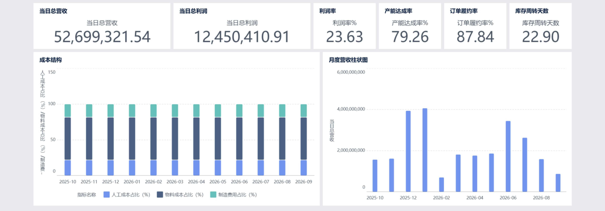

# FineBI 6.0 看板搭建步骤

> **本文档是唯一的一份 FineBI 看板操作手册**，覆盖：搭之前要知道的铁律 → 数据准备 → 从零搭组件 →
> 7 个看板逐个搭 → 比率类指标的正确做法 → 美化 → 验收 → 导出截图。
>
> **数据源**：MySQL 连接「制造数仓」→ `ads_db` 的 6 张 ADS 表。
> **当前数据范围**：`2025-10-01 ~ 2026-09-18`（353 天逐日，无断层）。
>
> 本文里的所有"对答案"数字均为 **2026-09-18 实测**，权威来源永远是库 ——
> 跑一次 `python scripts\verify_data.py` 可复核（19 项断言）。
>
> 历史上那几轮数据修正（6 处硬编码假指标、营收含已取消订单、库存看板全为 0…）与
> `table is full` 爆盘故障复盘，已归并到 `docs/PROJECT_MEMORY.md`（§3 口径决策 / §5 故障复盘），
> 本文只保留"搭看板时必须知道"的部分，见 **附录 B**。

---

# 一、搭之前必须知道的 3 件事

## 1.1 铁律：表粒度决定聚合方式

**同样是"求和"，用在明细表上是对的，用在天级快照表上就是错的。**

| 表 | 粒度（每行代表什么） | 行数 | KPI 卡正确做法 |
|---|---|---|---|
| `ads_boss_dashboard` | **一天**的经营全貌 | 353 | ⚠️ 必须**筛选到某一天**，**不能直接求和** |
| `ads_sale_analysis` | 一天 × 一客户 × 一产品 | 1,105,983 | ✅ 求和（金额、订单数） |
| `ads_produce_monitor` | 一天 × 一车间 × 一产品 | 331,853 | ✅ 求和（数量）；**比率要重算**，见 §四 |
| `ads_stock_health` | 一物料 × 一仓库（**单日快照**） | 600 | ✅ 求和（库存金额/数量） |
| `ads_cost_profit` | 一月 × 一产品 × 一车间 | 14,454 | ✅ 求和（成本额）；比率用**平均值** |
| `ads_alert_warning` | **一条预警** | 78 | ✅ 计数（COUNT） |

**比率型字段（%、天数）既不能"求和"，也不要直接"平均值"** —— 用计算字段重算：

| 指标 | 正确公式 |
|---|---|
| 产能达成率 | `SUM(actual_qty) / SUM(plan_qty)` |
| 良品率 | `SUM(qualified_qty) / SUM(actual_qty)` |
| 交付及时率 | `SUM(delivery_ontime_cnt) / SUM(delivery_cnt)` |

> 历史教训：原看板把逐日快照表当单行汇总表做**求和**，导致"当日总营收"显示 226 亿（353 天累计）、
> "利润率"显示 6412%。**聚合方式必须和表的粒度匹配。**

## 1.2 数据准备（10 分钟）

1. 打开 FineBI → `http://localhost:37799`
2. 左侧进入「**数据**」→「**分析主题**」
3. 新建主题，命名：`制造数仓看板`
4. 在主题里添加 6 个数据集：数据连接选「**制造数仓**」→ 库 `ads_db` → 依次添加：
   `ads_boss_dashboard`、`ads_sale_analysis`、`ads_produce_monitor`、
   `ads_stock_health`、`ads_cost_profit`、`ads_alert_warning`
5. **数据模式选择**：
   - 推荐「**抽取数据**」（查询快、加载快）
   - 代价：数据变了要**手动「更新」**（见 §六）
   - 想改完数据库刷新页面就见到，选「**直连数据**」，但大表（销售分析 110 万行）首次加载会慢
6. 逐个数据集检查字段类型：
   - `stat_date` / `alert_date` → **日期**
   - `stat_month` → 文本（`2025-10` 形式）
   - 所有 `*_amt` / `*_cost` / `*_rate` / `*_qty` / `*_cnt` → **数值**

## 1.3 数据更新机制：抽取 vs 直连

| | 抽取数据 | 直连数据 |
|---|---|---|
| 查询速度 | 快 | 取决于 MySQL |
| 数据更新 | **必须手动「更新」主题** | 刷新页面即可 |
| 适合 | 本项目（数据量 5 GB 级、看板多） | 数据实时性要求高、表小 |

> ⚠️ **最高频的误判**："ETL 跑完了，刷新浏览器看板却没变" —— 抽取模式下刷新浏览器不会重新取数，
> 必须去「数据 → 该分析主题 → 更新」，再 `Ctrl + F5`。

---

# 二、动手：从零搭第一个看板（点哪里）

> 流程：**新建分析主题 → 数据 → 组件 → 仪表板**

## 2.1 先理解 3 个概念，后面全是套路

| 概念 | 是什么 | 类比 |
|---|---|---|
| **分析主题** | 装一切的容器，有「数据 / 组件 / 仪表板 / 分析文档」4 个 TAB | 一个项目文件夹 |
| **组件** | 一张图表（指标卡、折线、饼图、明细表…） | 一块积木 |
| **仪表板** | 把多块积木拼成一页 | 拼好的成品 |

**每个组件都只由两部分组成**：

- **维度** = 按什么分类（日期、客户、产品、车间、区域…）
- **指标** = 算什么数（金额、数量、比率…）→ **指标必须选聚合方式**

## 2.2 五分钟做出第一个组件（指标卡）

1. 「我的分析」→ 选个文件夹 →「**新建分析主题**」，命名 `制造数仓看板`
2. 切到「**数据**」TAB → 点「**添加**」→「数据库表」→ 连接选「**数据连接**」→ 库选 `ads_db`
   → 勾选 `ads_boss_dashboard` → 确定
3. 切到「**组件**」TAB →「**新建组件**」→ 选择数据集 `ads_boss_dashboard`
4. 左侧图表类型选「**指标卡**」
5. 把字段 `total_revenue` 拖到「**指标**」区
6. 点这个指标 → 聚合方式选「**求和**」
7. 右上角「保存」→ 命名"当日总营收"
8. 重复 5~7 做出另外 5 个指标卡（当日总利润 / 利润率 / 产能达成率 / 订单履约率 / 库存周转天数）
   - **比率类**（利润率、产能达成率、订单履约率、库存周转天数）聚合方式选「**平均值**」

## 2.3 搭完「经营总览大屏」的骨架

**① 先加日期筛选器（最重要的一步）**

1. 切到「**仪表板**」TAB →「**新建仪表板**」
2. 上方「添加组件」→「**过滤组件**」→「**日期过滤**」
3. 绑定字段选 `stat_date`
4. 拖到仪表板**顶部**，右边设置里把默认值设为「**最新日期**」
5. 开启「**联动**」，让它影响本页所有组件

**② 把 6 个指标卡拖进仪表板** —— 排成一行。
拖完检查：营收应显示**千万级**（`52,699,321.54`），不是 22 亿。

**③ 加营收/利润趋势（折线图）**

- 新建组件 → 数据集 `ads_boss_dashboard` → 图表类型「**折线图**」
- 维度：`stat_date`｜指标：`total_revenue`、`total_profit`（都是求和）

**④ 加成本结构分析（100% 堆叠柱）**

- 新建组件 → 图表类型「**堆积柱状图**」
- 维度：`stat_date`（点字段旁的设置，改成按**月**显示）
- 指标：`material_cost_ratio`、`labor_cost_ratio`、`mfg_cost_ratio` —— 全部选「**平均值**」
- 这三列本身就是占比，**不要求和**

**⑤ 保存主题**

## 2.4 其余 6 个看板的套路

全部是同一个动作：**新建组件 → 拖维度 → 拖指标 → 选聚合 → 保存 → 拖进仪表板**。
差别只在"哪些字段、什么聚合、什么图"—— §三 已逐个列全。

**做的时候记住 4 条**：

| 组件类型 | 指标聚合 |
|---|---|
| 明细表 | 金额、数量 → **求和**；比率 → **平均值** |
| 时间趋势图 | 数值 → 求和；比率 → 平均值 |
| 排行图（Top N） | 求和 + **排序降序 + TOP N** |
| 分布图（饼图） | 求和（占比会自动算） |

---

# 三、7 个看板逐个搭

## 3.1 经营总览大屏（`ads_boss_dashboard`）

> ⚠️ **重灾区，必须加日期筛选器**（见 §2.3 ①）

| 卡片 | 字段 | 聚合 |
|---|---|---|
| 当日总营收 | total_revenue | 求和 |
| 当日总利润 | total_profit | 求和 |
| 利润率 | profit_rate | 平均值 |
| 产能达成率 | capacity_achieved | 平均值 |
| 订单履约率 | order_fulfill_rate | 平均值 |
| 库存周转天数 | inventory_turnover | 平均值 |

**图表**：
- **营收/利润趋势** —— 折线图，X 轴 `stat_date`，Y 轴 `SUM(total_revenue)` / `SUM(total_profit)`
- **成本结构分析** —— 100% 堆叠柱，X 轴 `stat_date`（按**月**分组），
  Y 轴 `AVG(material_cost_ratio)` / `AVG(labor_cost_ratio)` / `AVG(mfg_cost_ratio)`

**对答案（选定 2026-09-18）**

| 指标 | 正确值 |
|---|---|
| 当日总营收 | **52,699,321.54** |
| 当日总利润 | **12,450,410.91** |
| 利润率 | **23.63%** |
| 产能达成率 | **79.26%** |
| 订单履约率 | **87.84%** |
| 库存周转天数 | **22.90** |
| 物料/人工/制造占比 | **59.98% / 22.01% / 18.01%** |

> 卡片标题建议把"当日"改成「**选定日**」，避免和筛选器语义打架。
> 如果不想加筛选器，就全部改成「平均值」，但标题要改成「**日均**」。

## 3.2 销售分析（`ads_sale_analysis`）

**筛选器**：区域（下拉，7 个值）、统计日期（日期范围）

| 组件 | 类型 | 维度 | 指标/聚合 |
|---|---|---|---|
| 销售趋势 | 折线图 | stat_date | `SUM(order_amt)` |
| 客户排行 Top10 | 横向条形图 | customer_name | `SUM(order_amt)`，降序 + TOP 10 |
| 产品排行 Top10 | 横向条形图 | product_name | `SUM(order_amt)`，降序 + TOP 10 |
| 区域分布 | 饼图（或地图） | region | `SUM(order_amt)` |
| 交付及时率 | 指标卡 | — | 计算字段 `SUM_AGG(交付及时数量) / SUM_AGG(已交付数量)`（见下方注） |

**销售明细表**
- 列：统计日期、客户名称、产品名称、区域、订单数、订单金额、回款金额
- ⚠️ **排序：统计日期 降序**（原看板首屏全是 2025-10-01，就是因为没排序）
- 建议只显示前 500~1000 行，避免拖动卡顿

> 对答案：区域 **7** 个、客户 **301** 个；`交付及时率` 当日（2026-09-18）**87.84%**、全量 **87.99%**。
>
> ⚠️ **交付及时率的加权口径有个坑**：分母是「**已交付订单数**」（`delivery_cnt`），不是「订单数」。
>
> | 写法 | 全量 | 当日 | |
> |---|---|---|---|
> | `SUM(按时交付数)/SUM(已交付数)` | 87.99% | 87.84% | ✅ 正确 |
> | `SUM(order_cnt×及时率)/SUM(order_cnt)` | 80.36% | 80.41% | ❌ 按订单数加权，偏低约 7.5 个点 |
>
> **但 `ads_sale_analysis` 只有比率列 `delivery_ontime_rate`、没有计数列** ——
> 所以在这张表上**无法正确加权**。两种解法：
> 1. 该卡改用 `dws_sale_day`（有 `delivery_ontime_cnt` / `delivery_cnt`）—— 最快
> 2. 给 `ads_sale_analysis` 补这两列（改 DDL + 重跑 ETL）—— 最正统
>
> 顺带说明：本数据集各行交付率非常均匀（各天/各客户/各产品都 ≈88%），
> 所以「逐行平均」与「正确加权」在全量下**只差 0.0024 个点**（87.9921 vs 87.9945），
> 显示值都是 87.99。但方法仍应改对 —— 一旦数据分布变化，偏差会被放大。

## 3.3 生产监控（`ads_produce_monitor`）

**筛选器**：车间（下拉，6 个值）、统计日期（日期范围）

**新建 2 个计算字段**（本表核心，做法见 §四）：

| 字段名 | 公式 |
|---|---|
| `产能达成率_加权` | `SUM_AGG(实际产量) / SUM_AGG(计划产量)` |
| `良品率_加权` | `SUM_AGG(合格品数量) / SUM_AGG(实际产量)` |

| 组件 | 类型 | 维度 | 指标 |
|---|---|---|---|
| 当前产能达成率 | 指标卡 | — | `产能达成率_加权` |
| 良品率变化趋势 | 折线图 | stat_date | `良品率_加权` |
| 不良类型分布 | 饼图 | defect_type | `SUM(defect_qty)` |
| 车间产能/良率对比 | 双柱状图 | workshop_name | `产能达成率_加权`、`良品率_加权` |

**生产工单明细表**
- 列：统计日期、车间名称、产品名称、计划产量、实际产量、良品数量、不良品数量、主要不良类型、产能达成率
- ⚠️ **排序：统计日期 降序**

> 对答案（2026-09-18）：产能达成率 **79.26%**、良品率 **91.84%**（**必须加权，不能取逐行平均**）；
> `defect_type` 有 **5** 个取值（4 类真实不良 + 「未标注」占位）。

## 3.4 生产四象限（`ads_produce_monitor`）

> 把「车间产能达成率 × 良品率」画成四象限散点，一眼定位改进优先级。
> 阈值：产能达成率 **80%**、良品率 **95%**（与 notebook《02_capacity_quality_analysis》一致）。

**① 计算字段**（同 3.3，注意 ×100 或设百分比格式）

**② 散点图（核心）**
- X 轴：`产能达成率_加权`｜Y 轴：`良品率_加权`｜颜色：车间 `workshop_name`
- 加两条参考线：X = 80、Y = 95，把图切成四个象限
- ⚠️ **Y 轴标题要手动改**（默认是「组件」），填 `良品率(%)`；X/Y 轴范围设**自适应**，
  否则点位会挤在角落、大片空白

| 象限 | 判定 | 建议动作 |
|---|---|---|
| 双优 | 产能≥80% 且 良品率≥95% | 标杆，输出经验 |
| 高产低质 | 产能≥80% 但 良品率<95% | 优先改善质量 |
| 低产高质 | 产能<80% 但 良品率≥95% | 优先提升产能 |
| 双低 | 产能<80% 且 良品率<95% | 产能质量双线整改 |

## 3.5 库存健康（`ads_stock_health`）

> 本表是**单日快照**（600 行 @ 2026-09-18），所以**不加日期筛选器也能算对**；
> 但建议仍加一个「统计日期」筛选器，将来快照积累多天后不会出错。

| 组件 | 类型 | 维度 | 指标 |
|---|---|---|---|
| 库存金额 | 指标卡 | — | `SUM(stock_amt)` |
| 库存数量 | 指标卡 | — | `SUM(stock_qty)` |
| 呆滞物料占比 | 指标卡 | — | 计算字段 `SUM(is_slow_moving)/COUNT(*)*100` |
| 库存金额排行 | 横向条形图 | material_name | `SUM(stock_amt)`，TOP 20 |
| 仓库库存结构 | 饼图 | warehouse_id | `SUM(stock_amt)` |
| 周转天数分布 | 柱状图 | turnover_days（分箱 0-7/7-15/15-30/30+） | `COUNT(*)` |

**库存明细表**
- 列：物料名称、仓库ID、库存数量、库存金额、周转天数、是否呆滞
- **条件格式**：`is_slow_moving = 1` 的行标红 / 加"呆滞"标签
- 排序：库存金额 降序

> 对答案：**600 行**、基准日 **2026-09-18**、库存金额 **101,945.2 万元**、
> 呆滞 **11 个（1.83%）**。

## 3.6 成本利润分析（`ads_cost_profit`）

**筛选器**：统计月份（下拉，12 个值：2025-10 ~ 2026-09）、车间

| 组件 | 类型 | 维度 | 指标 |
|---|---|---|---|
| 平均毛利率 | 指标卡 | — | `AVG(profit_rate)` |
| 总成本 | 指标卡 | — | `SUM(total_cost)` |
| 月度毛利率趋势 | 折线图 | stat_month | `AVG(profit_rate)` |
| 成本结构趋势 | 堆叠柱状图 | stat_month | `SUM(material_cost)`、`SUM(labor_cost)`、`SUM(mfg_cost)` |
| 产品毛利率排行 | 横向条形图 | product_name | `AVG(profit_rate)`，降序 |
| 产品单位成本排行 | 横向条形图 | product_name | `AVG(unit_cost)`，降序 |

**成本利润明细表**
- 列：统计月份、产品名称、车间名称、单位成本、销售均价、单位毛利、毛利率
- ⚠️ **排序：统计月份 降序**

> 对答案：**14,454 行**、**12 个月**、平均毛利率 **23.43%**（区间 **-105.69% ~ 34.53%**）。
> 负毛利率是数据本身的分布（个别产品销售均价低于成本），想突出异常可加条件格式标红。

## 3.7 异常预警清单（`ads_alert_warning`）

**筛选器**：预警类型（5 个值）、预警等级（高/中/低）

| 组件 | 类型 | 维度 | 指标 |
|---|---|---|---|
| 预警总数 | 指标卡 | — | `COUNT(*)` |
| 高等级预警数 | 指标卡 | — | 计算字段 `SUM(IF(alert_level='高',1,0))` |
| 按类型分布 | 柱状图 | alert_type | `COUNT(*)` |
| 按等级分布 | 饼图 | alert_level | `COUNT(*)` |

**预警明细表**
- 列：预警日期、预警类型、预警等级、预警对象名称、当前值、阈值、预警描述
- **排序优先级**：预警等级（高→中→低）
- **条件格式**：高=红、中=橙、低=黄

> 对答案：共 **78** 条 —— 回款滞后 30、营收缺口 25、库存积压 11、不良超标 6、产能不足 6；
> 等级 高 34 / 中 6 / 低 38。
> ⚠️ 「回款滞后」的 `alert_date` 取的是**数据内最新发货日**（刻意不用 `CURDATE()` 以保证幂等），
> 而发货日可推到未来（`order_date + 1~40 天`），所以这条预警的日期可能**晚于今天**，
> 属已知现象，详见 `docs/PROJECT_MEMORY.md §7.0`。

---

# 四、比率类指标的正确做法（计算字段）

## 4.1 先理解：KPI 卡片的「汇总方式」里没有"加权"

点字段会弹出 `汇总方式 / 快速计算 / 二次计算 / 过滤 / 数值格式 / 特殊显示 / 设置显示名 / 复制 / 删除`，
而 `汇总方式` 里只有 **求和 / 平均 / 最大 / 最小 / 计数 / 去重计数** ——
**没有任何一个能得到 `SUM(a)/SUM(b)`**：

- 选「平均」→ 逐行比率的平均值。全量算下来产能达成率 = `77.76`（**错**）
- 选「求和」→ 一堆百分数相加，几百上千，更离谱

**唯一正解：新建「计算字段」，把聚合写进公式。**
字段一旦含 `SUM_AGG(...)`，FineBI 就把它当成已聚合的指标，不再二次聚合。

## 4.2 操作步骤

1. 组件「数据」面板 → 点右上角 **「+」→ 添加计算字段**
2. 名称 `产能达成率_加权`，公式：
   ```
   SUM_AGG(实际产量) / SUM_AGG(计划产量)
   ```
3. 数值格式选 **百分比、2 位小数** → 显示 `79.26%`
4. 回到 KPI 卡，把 `文本` 里的旧字段**换成新字段**
   （换完汇总方式会自动变成"自动/聚合"，**不要再手动设成平均**）

> ⚠️ **字段在 FineBI 里显示的是中文别名**（`实际产量` / `计划产量` / `合格品数量`），
> 不是底层的 `actual_qty` / `plan_qty`。以左侧字段列表显示的名为准。
> 公式正确时字段名显示成**蓝色**（= 已被识别为有效字段）。
> `SUM_AGG` 是 FineBI 的聚合求和函数（函数列表里按"聚合"分类找）。

**三个实操坑**：

1. **括号必须配对**。写成 `SUM_AGG(实际产量) / SUM_AGG(计划产量`（末尾少 `)`）会报
   **"语法错误，缺少标示符"** —— 报这个错先数左右括号。
2. **别手打字段名**。输入 `SUM_AGG(` 后**双击左侧字段名**让它自动插入，最后补 `)`。
   手打容易因下划线/大小写/别名不一致而失败。
3. 公式算出来是小数 `0.7926`，要另外设「数值格式 → 百分比、2 位小数」才是 `79.26%`。

## 4.3 结果验证：别只对数字，要对"范围"

**诊断表（三分钟定位"是口径错还是范围错"）**

| 显示值 | 对应口径 | 结论 |
|---|---|---|
| `77.76` | `AVG(产能达成率)` 全量逐行平均 | ❌ **口径错**（用了平均值）→ 改计算字段 |
| `77.89` | `SUM(实际产量)/SUM(计划产量)` 全量 353 天 | ⚠️ **口径对了、范围错了** → 补日期筛选 |
| `79.26` | `SUM/SUM` 当日 2026-09-18 | ✅ **目标值** |

> 若停在 `77.89`：公式别再动，去补**日期范围**。

## 4.4 日期范围：结果过滤器 vs 日期过滤组件

| | 结果过滤器 | 日期过滤组件 |
|---|---|---|
| 位置 | 组件内（右侧面板） | 仪表板上（可视化控件） |
| 值 | **静态**（写死某天，数据更新后会过期） | 可动态 / 可交互 |
| 影响范围 | 仅本组件 | 可作用于多个组件 |
| 适合 | **调试验证** | **正式交付** |

**正式做法**：
1. 仪表板编辑态 → 从「过滤组件」拖入 **日期/时间过滤组件**，绑定 `stat_date`
2. **默认值设为「最新日期」**（不要写死某一天）
3. ⚠️ 选中该筛选器 → 右侧 **「作用于」** → 确认**勾上了目标组件**（最容易漏的一步）

> ⚠️ **又一个坑：字段"拖进"结果过滤器 ≠ 生效**。
> 把 `统计日期` 拖进「结果过滤器」只是挂上了字段，**必须再点该字段标签 → 菜单里的「过滤...」
> → 选条件（等于 / 区间 / …）→ 填值 → 确定**，组件才会重算。
> 实测：只拖入不设条件时，卡片仍停在 `77.89%`。

---

# 五、样式、排序与美化

**① 计算字段**（比率算不准时用）—— 见 §四。

**② 排序**
- 排行图：把指标字段拖到「**排序**」区，选**降序**
- 明细表：把 `stat_date` 或 `stat_month` 拖到排序区选**降序**
  ←（不设的话首屏永远是 2025-10-01，看着像"没更新"）

**③ TOP N**
- 排行图右侧设置里找「**结果过滤器**」/「显示前 N 项」→ 填 10 或 20

**④ 数字格式**
- 点指标字段 → 「**数值格式**」：金额勾选"千分位"
- 比率选"百分比"、保留 2 位小数
- **大数字建议把单位改成「万」** —— 实测有个 KPI 卡的 `12,450,410.91` 因为放不下，
  被卡片**裁成了 `2,450,410.9`**（首尾各裁一位），1,245 万被读成 245 万。
  改成 `1,245.04 万` 后字符数减半，问题消失。

**⑤ 条件格式**（预警清单必用）
- 明细表 → 把 `alert_level` 拖到「**颜色**」区 → 手动分配：高=红、中=橙、低=黄

**⑥ 布局**
1. **筛选器统一放页面顶部**，所有图表都联动它
2. **大屏用深色主题，分析类看板用浅色**（仪表板右上角「主题」里换）
3. **卡片大小对齐**：拖的时候注意对齐辅助线；选中多个组件可以「等宽/等高」
4. **一屏原则**：经营总览大屏尽量不出现滚动条
5. **每个组件标题写清口径**，例如"利润率（选定日）"，避免和"日均"混淆
6. **四象限的轴标题要手动改**（默认是「组件」）

---

# 六、数据更新（抽取模式必看）

抽取模式下**刷新浏览器不会重新取数**，必须：

> 「数据」→ 找到 `制造数仓看板` 主题 → 点「**更新**」→ 等提示完成 → 回看板 `Ctrl + F5`

建议在主题上配置「**定时更新**」（例如每天 08:30，ETL 完成之后），就不用每次手点了。

> 顺带提醒：`TRUNCATE` 会**隐式提交**事务，而 ETL 调度器是"整个脚本成功才 commit"，
> 所以步骤中途失败可能出现"前面的 TRUNCATE 已生效、后面的 INSERT 被回滚 → 表被清空"。
> 这是已知遗留风险，详见 `docs/PROJECT_MEMORY.md §4.5`。

---

# 七、验收清单（逐项打勾）

| # | 检查项 | 期望 |
|---|---|---|
| 1 | 大屏任意 KPI 卡不出现 8 位以上数字 | 营收应在千万级（5,270 万） |
| 2 | 大屏所有 % 类指标都在 0~100 之间 | 利润率 23.63、产能 79.26、履约率 87.84 |
| 3 | **比率卡必须是加权值** | 产能达成率 `79.26%`（不是 `77.76%`、也不是 `77.89%`） |
| 4 | 大屏 KPI 卡数字完整未被裁切 | 利润 `12,450,410.91` 或 `1,245.04 万` |
| 5 | 库存健康明细表 600 条、金额非 0 | 101,945.2 万元 |
| 6 | 成本利润明细 14,454 条、覆盖 12 个月 | 2025-10 ~ 2026-09 |
| 7 | 生产监控不良类型有 5 个取值 | 含 4 类真实不良 + 「未标注」 |
| 8 | 异常预警有 5 种类型、78 条 | 等级含高/中/低 |
| 9 | 所有明细表首行是最新日期 | 不是 2025-10-01 |
| 10 | 图表 Y 轴量级合理 | 良品率 90 左右，不是 80,000 |
| 11 | 换一个日期，所有卡片跟着变 | 说明筛选器联动生效 |

> 若第 1 条不满足（比如营收还是 22 亿），说明那张卡没被日期筛选器覆盖到 ——
> 去检查筛选器的「联动 / 作用于」设置，或把该卡片的聚合方式改成「平均值」。

---

# 八、导出看板截图（用于 README 内联展示）

## 8.1 先认清一个限制

**FineBI 6.0 的仪表板级导出只有两个选项：`导出Excel` 和 `导出Pdf`，没有"导出图片"。**
（`bl/` 目录里那 7 份 PDF 就是这么来的。）

而 README 里要内联显示**必须是位图** —— PDF 在 Markdown 里无法内联。所以走：
**FineBI 导出 PDF → 脚本转 PNG**。

## 8.2 一个反直觉的事实

实测 `bl/经营总览大屏.pdf`：**1 页、页面尺寸 4950×2621、内嵌 1 张同尺寸位图**。
也就是说 FineBI 导出的 PDF **不是矢量图**，而是把整个仪表板渲染成一张大位图塞进去。

**推论**：PDF→PNG 只是把这张大图按目标宽度等比缩小，**不存在"矢量转位图失真"问题**。

## 8.3 操作流程

```powershell
# 1) 先在 FineBI 里更新数据（抽取模式必须手动）
#    数据 → 分析主题「制造数仓看板」→ 更新 → 浏览器 Ctrl+F5

# 2) 逐个看板：右上角「导出」→「导出Pdf」→ 覆盖保存到 bl/（文件名不要改）
#    共 7 个：经营总览大屏、销售分析、生产监控、生产四象限、库存健康、成本利润分析、异常预警清单

# 3) 一条命令转成规格统一的 PNG
python scripts\export_screenshots.py
#    → docs/screenshots/01-boss-dashboard.png ... 07-alert-warning.png
```

实测（2026-09-18）：7 份 PDF 共 2.5 MB → **7 张 PNG 共约 1.35 MB**，
单张 84 ~ 288 KB，**尺寸统一 1434 px 宽**。

脚本做了两件后处理，都是为了让 README 里整齐好看：

1. **自动裁白边** —— FineBI 导出的页面里仪表板只占上半部分（实测 1600×848 里有 357 px 是空的）。
   判定方式＝以左上角像素为背景色、取"差异 > 8"的像素外接矩形，再加 0.8% 内边距。
   （**不能用"亮度 < 250"**：页面背景本身就是浅灰 245，会把整页判成内容，裁不掉。）
2. **统一输出宽度** —— 各看板内容宽度天然不同（裁边后 837 ~ 1434 px）。
   做法是**居中补边到最大宽度、不缩放** —— 缩放会把窄图放大变糊，
   而这些截图的可读性全靠 1:1 原始分辨率。

开关：`--width`（基础渲染宽度）、`--no-trim`、`--no-unify`、`--out`、`--dry-run`。

## 8.4 两个坑

1. **别把超大截图 `git add` 进仓库**。仓库历史里曾有一批 `12429×6045` 级别的整页截图，
   二进制对象不可增量存储，直接把 `.git` 撑到 **57 MB**（内容其实只有 1.3 MB）。
   现状与清理方法见 `docs/PROJECT_MEMORY.md §7.5`。
2. **PDF 不进版本控制**。`.gitignore` 里的 `bl/*.pdf` 保持忽略；
   PNG 放 `docs/screenshots/`（该路径没有任何忽略规则），README 用**相对路径**引用。

## 8.5 README 引用写法

```markdown
## 看板截图

**1. 经营总览大屏** · 逐日快照，KPI 卡绑定「最新日期」


```

文件名刻意用**英文+序号**：仓库里已用中文文件名没问题，但 Windows 命令行 +
默认 `core.quotepath=true` 会把中文名显示成八进制转义，排查时很烦。

---

# 附录 A：常见坑汇总

1. **比率字段用了"求和"或"平均值"** ← 最根本的坑。任何 `%`、`天数` 字段，先问自己
   "加起来/平均有业务意义吗"，没有就用计算字段 `SUM_AGG(a)/SUM_AGG(b)`
2. **快照表没加日期筛选器** ← `ads_boss_dashboard` 有 353 行，不加筛选器就是累计值
3. **字段拖进结果过滤器≠生效** ← 还要点「过滤...」设条件
4. **筛选器没勾"作用于本组件"** ← 加了筛选器但卡片没变，八成是这个
5. **KPI 卡数字被裁切** ← 大数字把单位改成「万」，或调小字号 / 加宽卡片
6. **明细表没排序** ← 首屏永远显示最老数据，看着像"没更新"
7. **抽取模式忘了点更新** ← 数据改了看板不变
8. **TOP N 忘了设排序** ← "客户排行"会按名字排而不是按金额排
9. **计算字段漏了分母保护** ← 建议 `SUM_AGG(a)/NULLIF(SUM_AGG(b),0)`，避免除零显示异常
10. **四象限的轴标题是默认的「组件」** ← 要手动改

---

# 附录 B：数据口径速查（曾经的 8 个坑，现已修正）

> 这些是 2026-09-10 ~ 09-18 几轮数据修正中改掉的问题。**看板口径有疑问时先看这里**，
> 完整的根因分析与故障复盘见 `docs/PROJECT_MEMORY.md §3 / §5`。

| # | 曾经的问题 | 现在的正确口径 |
|---|---|---|
| 1 | **库存看板整块是空的** —— `step04` 直接写 `0 AS stock_qty, 0 AS stock_amt`，因为 DWD 层缺 `dwd_stock_snapshot` 表 | 补 `dwd_stock_snapshot` 事实表；库存数量/金额改取快照**结存**；周转天数 = 当日库存金额 ÷ 近 30 天日均出库金额 |
| 2 | **营收虚高约 20%** —— 已取消订单被计入营收 | `dws_sale_day` / `dws_sale_month` 增加 `order_status NOT IN ('已取消','已作废')` |
| 3 | **大屏"当日总营收"是 9 个月累计、表只有 1 行** | 改为**逐日快照**（现 353 行），趋势/环比/日期筛选才能做 |
| 4 | **订单履约率口径偏低**（把 17 万未发货订单算作"不按时"） | 改为**交付及时率 = 按时交付订单数 ÷ 已交付订单数**，`dws_sale_day` 新增 `delivery_cnt` |
| 5 | **6 处硬编码"假指标"**：利润率恒 15、周转天数恒 45、成本结构恒 45/25/30、销售均价 = 成本×1.3、毛利率恒 23.08%、不良类型恒"尺寸偏差"、预警等级恒"高" | 全部改为真实计算（大屏利润为**毛利口径** = 营收 − 已售产品成本） |
| 6 | **时间范围写死**（成本分析只到 3 个月） | 全部按库内数据**动态计算** |
| 7 | **`oee_rate` 名不符实** —— 实际算的是产能达成率 | **保留列名**（改名会打断 FineBI 图表绑定），只加注释说明 |
| 8 | **库存健康 `LIMIT 100`** 导致"呆滞占比"数学上永远算不准 | 去掉 LIMIT，全量 600 行入表 |

**两条与口径相关的设计取舍**：

- **「营收缺口」预警**口径 = 「已取消订单金额」占当月下单金额 ≥ **12%**。
  原口径（产品营收环比下滑 ≥20%）在现有仿真数据下**恒为空**（各产品同涨同跌，环比下滑数为 0）。
  若将来补了月度营收目标表，可改为"实际营收 < 目标 × 80%"。
- **「回款滞后」基准日** = **数据内最新发货日**，刻意**不用 `CURDATE()`** ——
  否则同样数据不同天跑出不同结果，不幂等。
  副作用：发货日可推到未来（`order_date + 1~40 天`），所以该预警的日期可能晚于今天，见 §3.7。

---

# 附录 C：数据现状速查（2026-09-18 实测）

| 表 | 行数 | 时间范围 |
|---|---|---|
| `ads_boss_dashboard` | 353 | 2025-10-01 ~ 2026-09-18（逐日，无断层） |
| `ads_sale_analysis` | 1,105,983 | 2025-10-01 ~ 2026-09-18 |
| `ads_produce_monitor` | 331,853 | 2025-10-01 ~ 2026-09-18 |
| `ads_stock_health` | 600 | 2026-09-18（单日快照） |
| `ads_cost_profit` | 14,454 | 2025-10 ~ 2026-09（12 个月） |
| `ads_alert_warning` | 78 | 五类预警 |

全量口径：营收 **260.33 亿**（DWD = DWS = ADS 四层一致）；
生产 plan/actual/defect = **71,105,047 / 55,384,455 / 4,795,173**（不良率 8.66%）。

**复核方式**（权威来源永远是库，不是文档）：

```powershell
python scripts\verify_data.py     # 19 项断言，全通过退出码 0；会打印真实行数 / 日期范围
```

> ⚠️ 本附录之前散落在 `BI看板数据修正说明.md` 里的多轮数字（273 / 695,618 / 852,817 / 51 等）
> 都是**不同轮次的中间态**，已随该文件合并删除。**引用数据前请先跑一次 `verify_data.py`。**
